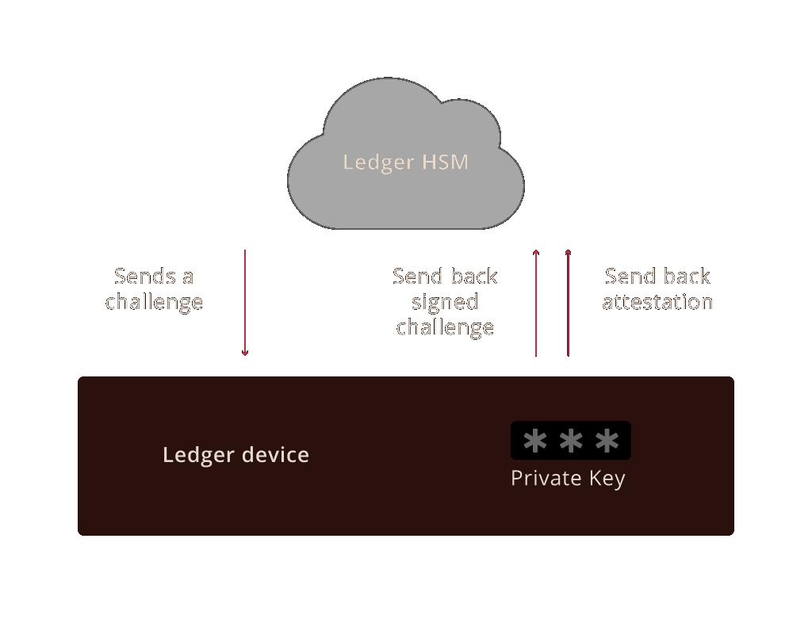
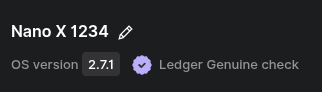
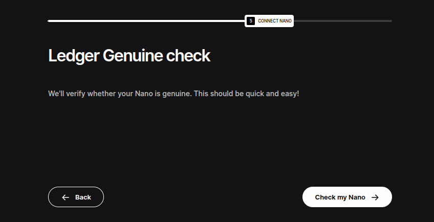

The ability to prove the genuineness of the device's secure element is one of the main security features, from both hardware and firmware points of view. The hardware wallet must include a secure mechanism for this, and it is of utmost importance. Otherwise, an attacker could replace a genuine device with a fake, backdoored one (through supply chain or evil maid attacks, for instance). In this case, they would be able to access the crypto assets afterward.

Classic anti-tampering seals (or holographic seals) can give a false sense of security: not only are they trivial to clone, but it is also easy to open and close a package without damaging the seal.

### What is an attestation and how does it work?

Attestation is a validation process used to check the genuineness of Ledger secure elements.
In simple terms, every time you use a Ledger device to process a critical action at the firmware level (such as updating the OS or installing or removing apps), an HSM (secure server) sends a challenge to the secure element (a randomly generated number). This means it is requesting the device to prove the genuineness of its secure element. The secure element can prove that it is genuine by providing a correct signature for the challenge.
If the server is able to verify the signature from the secure element, it validates its genuineness and allows the connection. Otherwise, it blocks it.
Let’s take a closer look at it.

### Setting up an attestation for Ledger signers during manufacturing

To make use of a Root of Trust, the following steps take place **during manufacturing** of a device:

* Each Ledger device’s secure element generates a unique key pair: a **public key** and a **private key**. The private key is stored inside the secure element and cannot be extracted.
The same principle is used for your cryptocurrency accounts.
* The secure element sends its public key to Ledger’s HSM (secure server).
* Our HSM (secure server) signs the public key with the Ledger Root of Trust and sends it back to the device. This signed public key is the device’s attestation.

This attestation allows Ledger’s HSM to verify afterward whether the secure element is genuine.

### Using the Root of Trust after manufacturing

After manufacturing, this attestation allows the user (through Ledger Wallet) to verify if the device's secure element is genuine.

Here is how it works:

* **Ledger’s HSM** (secure server) sends a challenge to the **Ledger device**.
* The Ledger device’s **secure element** signs the challenge it receives using its private key. This signature is sent back to **Ledger’s HSM along with the attestation** (signed public key).
* **Ledger’s server** can then authenticate the Ledger secure element by doing the following:
  * Verify the attestation of the device (that the given public key is actually signed by the HSM)
  * Verify the challenge with the attestation.

If the secure element’s signature is confirmed as correct by the HSM, the secure element is established as genuine and is allowed to access the Ledger Wallet manager.

Otherwise, an error message indicates that the genuine check could not be completed, and the Ledger Wallet application will not interact further with the device.

This authentication procedure protects Ledger users against counterfeited Ledger devices.

### When do we use a Root of Trust to check if a device is genuine?

* When you connect your signer to Ledger Wallet for the first time during the genuine check (see image above)
* Each time you access the Ledger Wallet application
* Every time you install an application from the Ledger Wallet application
* Each time you update your firmware.

None of the above can be performed with a counterfeit device.

### End User Physical Verification

Note that a Genuine check cannot detect unauthorized physical modifications to the hardware, such as spying implants, if the original Secure Element remains intact.

This is why buying directly [from Ledger or Authorised Resellers](https://www.ledger.com/reseller) is safer: Ledger’s Genuine Check confirms authenticity, but it cannot verify the device’s physical supply chain history.

Moreover, Ledger signers are designed so users can check the integrity of their devices by themselves as detailed in [this support article](https://support.ledger.com/article/4404382029329-zd).

> **Associated Threats**: An attack that allows extraction of a device attestation is a major threat to the genuineness security mechanism. Generally speaking, any attack that allows a non-genuine device to pass the genuine check is a valid attack.
